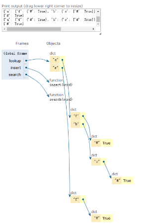

```python
class Trie:
    def __init__(self):
        self.lookup = {}
    def insert(self,word):
        tree = self.lookup
        for s in word:
            if s not in tree:
                tree[s] = {}
            tree = tree[s]
        tree['end']=word
    def search(self,word):
        tree = self.lookup
        for s in word:
            if s not in tree:return False
            tree = tree[s]
        return 'end' in tree
    def find(self,word):
        tree = self.lookup
        for s in word:
            if s not in tree:return False
            tree = tree[s]
        return self.dfs(tree)
    def dfs(self,tree):
        cur = []
        for k,v in tree.items():
            if "end" in k:
                cur+=[v]
            else:
                cur+=self.dfs(tree[k])
        return cur

if __name__ == '__main__':
    trie = Trie()
    l = ['a','abc','abd','de']
    for word in l:
        trie.insert(word)
    print(trie.lookup)
    print(trie.search('ab'))
    print(trie.find('a'))
```

本质：字典套字典，应用搜索推荐，输入一个字，自动匹配前缀词

