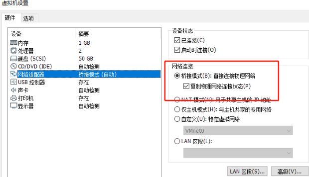
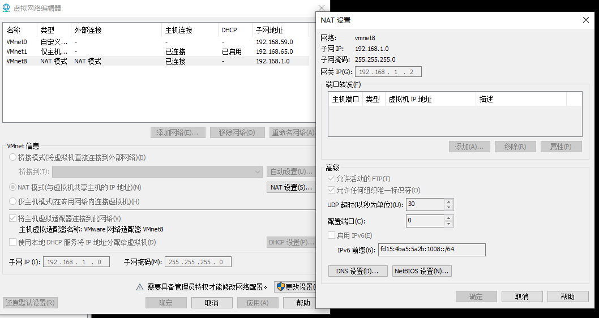

### 常用命令

- ### python环境

```shell
yum install vim #centos
yum install -y gcc
yum install unzip
```

+ ### ubuntu更换源

  ```shell
  sudo aptitude install open-vm-tools-desktop #安装复制粘贴包
  sudo cp /etc/apt/sources.list /etc/apt/sources.list.backup #备份原始文件
  sudo apt install vim #ubuntu
  sudo vim /etc/apt/sources.list #编辑镜像源文件,将源文件内容全部注释，添加阿里源内容,保存
  sudo apt-get update #更新源
  sudo apt-get dist-upgrade #更新源
  #sudo apt-get upgrade #更新软件
  
  sudo apt-get install aptitude
  ln -s /usr/bin/python3 /usr/bin/python #创建软链接
  sudo aptitude install python3-pip #安装pip，切换镜像源
  mkdir ~/.pip #在用户主目录下创建.pip文件夹
  vim ~/.pip/pip.conf #创建并打开pip.conf
  [global]
  index-url = https://pypi.tuna.tsinghua.edu.cn/simple
  sudo apt install --reinstall python3-minimal #重装内核，解决登录问题
sudo chmod 777 home #修改文件权限
  ```

  ubuntu 20阿里源
  
  ```shell
  deb http://mirrors.aliyun.com/ubuntu/ focal main restricted universe multiverse
  deb-src http://mirrors.aliyun.com/ubuntu/ focal main restricted universe multiverse
  
  deb http://mirrors.aliyun.com/ubuntu/ focal-security main restricted universe multiverse
  deb-src http://mirrors.aliyun.com/ubuntu/ focal-security main restricted universe multiverse
  
  deb http://mirrors.aliyun.com/ubuntu/ focal-updates main restricted universe multiverse
  deb-src http://mirrors.aliyun.com/ubuntu/ focal-updates main restricted universe multiverse
  
  deb http://mirrors.aliyun.com/ubuntu/ focal-proposed main restricted universe multiverse
  deb-src http://mirrors.aliyun.com/ubuntu/ focal-proposed main restricted universe multiverse
  
  deb http://mirrors.aliyun.com/ubuntu/ focal-backports main restricted universe multiverse
deb-src http://mirrors.aliyun.com/ubuntu/ focal-backports main restricted universe multiverse
  ```
  
## 查看硬件信息

```shell
yum install vim
yum install -y gcc
yum install unzip
cat /etc/redhat-release #查看linux系统版本
chmod +x 文件名 #权限问题
crontab -e #编辑定时任务
crontab -l #查看定时任务
cat /proc/cpuinfo | grep name | cut -f2 -d: | uniq -c #查看CPU
free -h #查看内存
cat /sys/block/sda/queue/rotational #0表示固态，1表示非固态
df -h #查看硬盘占用
du -h --max-depth=1 #查看所有占用大小
w #查看登录用户
systemctl start  atd.service #开启定时at服务
cat /proc/cpuinfo | grep name | sort | uniq #查看CPU型号
cat /proc/cpuinfo | grep "physical id" | sort | uniq | wc -l #查看CPU数量
cat /proc/cpuinfo| grep "cpu cores"| uniq #查看CPU核数
cat /proc/cpuinfo| grep "processor"| wc -l #查看逻辑CPU数目
lscpu #CPU信息概览
tar -zcf #压缩文件
tar -zxf #解压缩
```

centos网络配置

```shell
cat /etc/sysconfig/network-scripts/ifcfg-ens33 
vi /etc/sysconfig/network-scripts/ifcfg-ens33 
systemctl restart network #重启网络
ping www.baidu.com #测试
systemctl status firewalld.service #查看防火墙
systemctl stop firewalld.service    #关闭防火墙
systemctl disable firewalld.service #禁止防火墙
```

vim编辑器

```python
i #编辑模式
esc #命令模式
:wq #保存退出
```

编辑网卡

```shell
TYPE="Ethernet"
PROXY_METHOD="none"
BROWSER_ONLY="no"
BOOTPROTO="static"
DEFROUTE="yes"
IPV4_FAILURE_FATAL="no"
IPV6INIT="yes"
IPV6_AUTOCONF="yes"
IPV6_DEFROUTE="yes"
IPV6_FAILURE_FATAL="no"
IPV6_ADDR_GEN_MODE="stable-privacy"
NAME="ens33"
UUID="24f1055b-3faa-44a2-89ba-d7ec625b9a40"
DEVICE="ens33"
ONBOOT="yes"
BROADCAST=192.168.1.255
IPADDR=192.168.1.186
NETMASK=255.255.255.0
GATEWAY=192.168.1.1
DNS1=192.168.1.1
```






